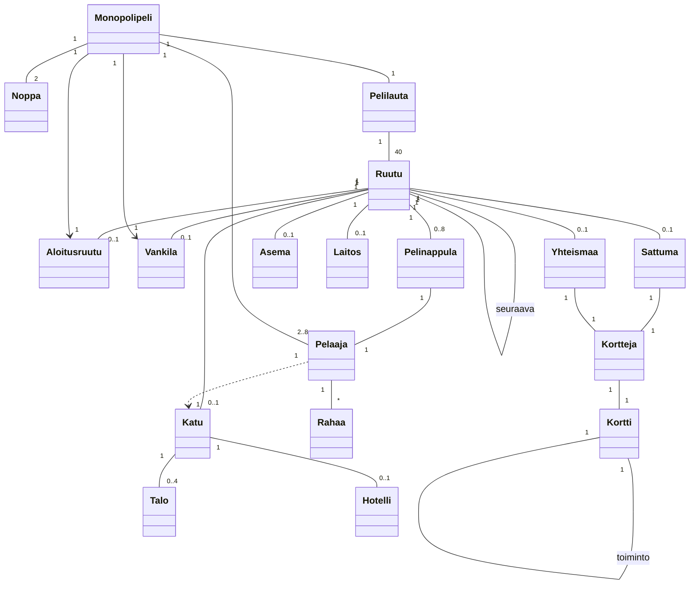

```mermaid
 classDiagram
    Monopolipeli "1" -- "2" Noppa
    Monopolipeli "1" -- "1" Pelilauta
    Pelilauta "1" -- "40" Ruutu
    Ruutu "1" -- "0..1" Aloitusruutu
    Ruutu "1" -- "0..1" Vankila
    Ruutu "1" -- "0..1" Sattuma
    Ruutu "1" -- "0..1" Yhteismaa
    Ruutu "1" -- "0..1" Asema
    Ruutu "1" -- "0..1" Laitos
    Ruutu "1" -- "0..1" Katu
    Ruutu "1" -- "1" Ruutu : seuraava
    Ruutu "1" -- "0..8" Pelinappula

    Pelinappula "1" -- "1" Pelaaja
    Pelaaja "2..8" -- "1" Monopolipeli
    Pelaaja "1" -- "*" Rahaa

    Sattuma "1" -- "1" Kortteja
    Yhteismaa "1" -- "1" Kortteja
    Kortteja "1" -- "1" Kortti
    Kortti "1" -- "1" Kortti : toiminto

    Katu "1" -- "0..4" Talo
    Katu "1" -- "0..1" Hotelli

    Monopolipeli "1" --> "1" Aloitusruutu
    Monopolipeli "1" --> "1" Vankila
    


    Pelaaja "1" ..> "1" Katu


    
    

    
```
