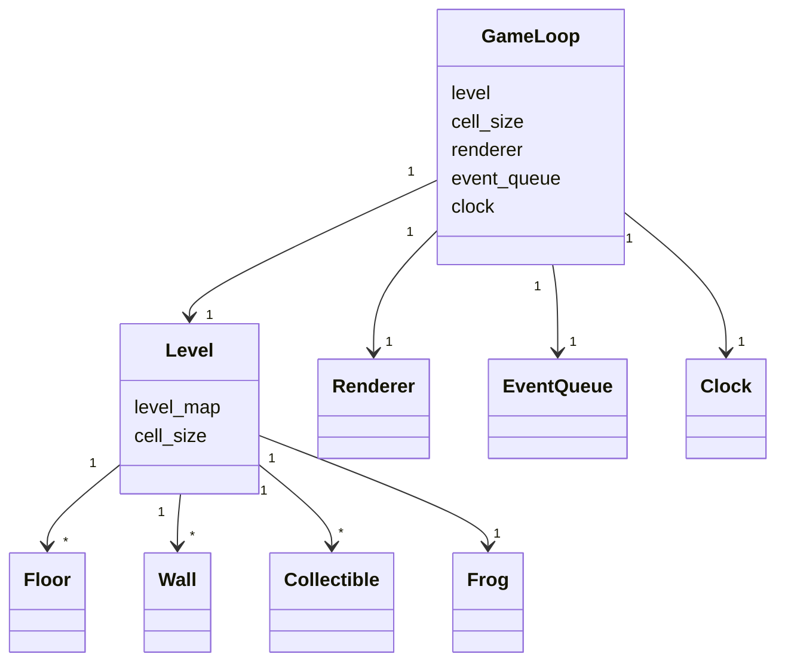
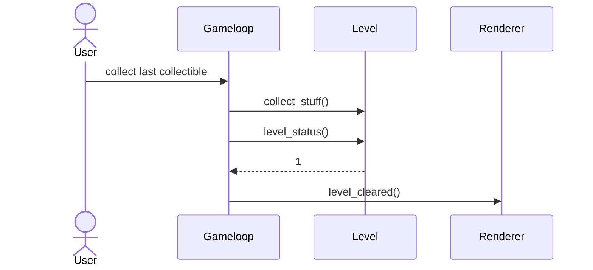

### Class diagram

```mermaid
classDiagram
  GameLoop "1" --> "1" Level
  GameLoop "1" --> "1" Renderer
  GameLoop "1" --> "1" EventQueue
  GameLoop "1" --> "1" Clock
  Level "1" --> "*" Floor
  Level "1" --> "*" Wall
  Level "1" --> "*" Collectible
  Level "1" --> "1" Frog
  class GameLoop{
      level
      cell_size
      renderer
      event_queue
      clock
    }
  class Level{
      level_map
      cell_size
    }
```

### Completing a level

```mermaid
sequenceDiagram
  actor User
  participant Gameloop
  participant Level
  participant Renderer
  User->>Gameloop: collect last collectible
  Gameloop->>Level: collect_stuff()
  Gameloop->>Level: level_status()
  Level-->>Gameloop: 1
  Gameloop->>Renderer: level_cleared()
```
  
  
  
