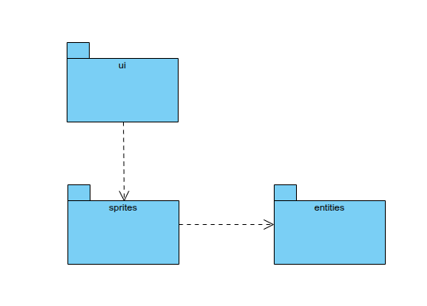
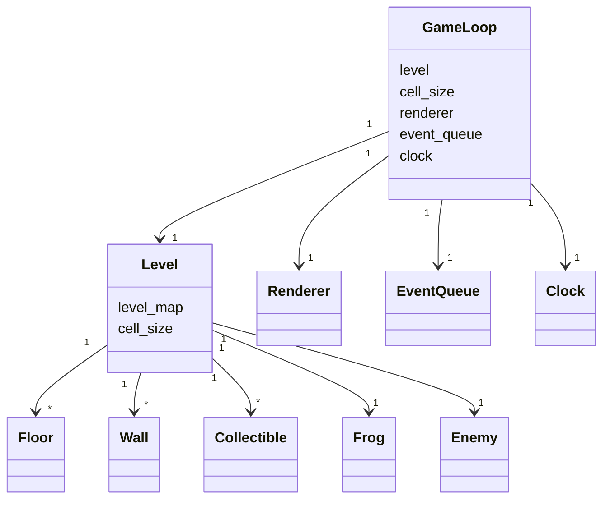
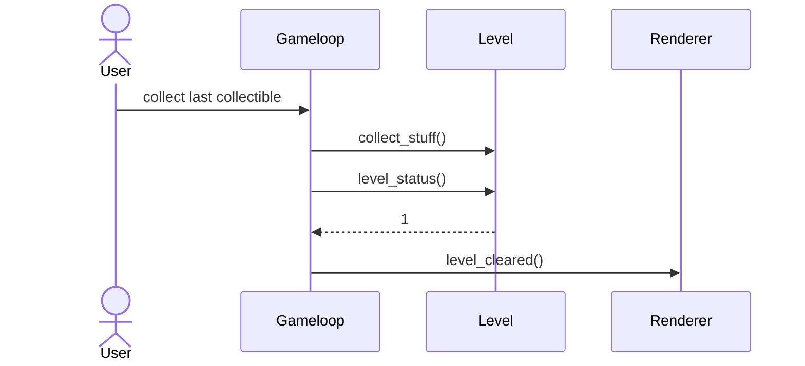

# Architecture description

## Structure
The package structure of the program is as follows:
  
The package _ui_ contains the code responsible for the UI, _entities_ contains code responsible for data objects used by the application and _sprites_ contains code for different sprite objects that make up the game.

## User Interface
The UI consists of the game view created by the class _Renderer_.
The view updates consistently as the game progresses; based on the set value of fps, the function _render_ gets called. It checks whether the level was cleared or the game is over and updated the view if necessary. Afterwards, it draws all the sprites onto the screen: when the playable character or enemies move or collectibles are collected, the attribute _all_sprites_ of the level (which has been passed to the renderer) is updated. This way, the view is updated in real-time.

## Application Logic

#### Class diagram

  

### Completing a level

  
  
  
