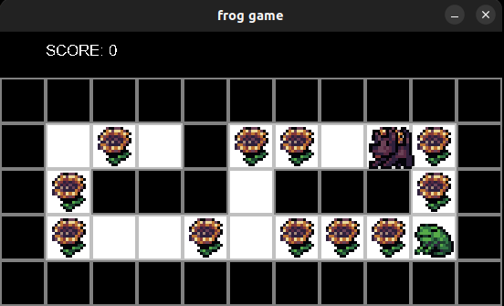

# User guide

Download the latest [release](https://github.com/froghoarder/ot-harjoitustyo/releases) by selecting the _Source code_ from the release's _Assets_.


## Starting the application

Install the necessary dependencies before starting the game (with "pacman-game" as your current directory):

```
poetry install
```

Then you can start the application with the command:

```
poetry run invoke start
```

## Playing the game

When the game starts it will look something like this:  
  
You can move the playable character by using either the arrow keys or WASD-keys. The goal of the game is to collect all flowers while managing to not get caught by the dog.  
If you get caught, it's game over. If you collect all flowers before getting caught, you win!

